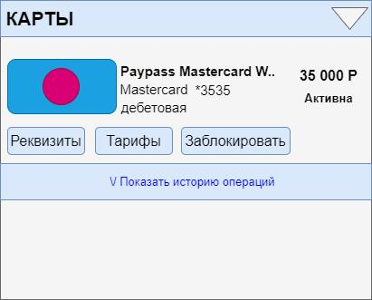
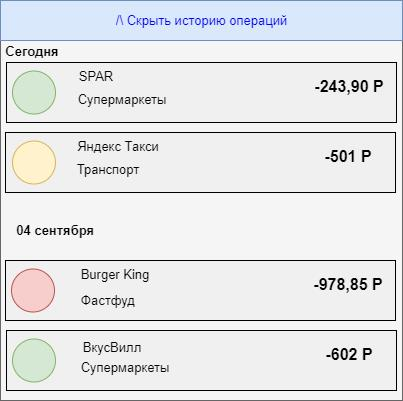

# Frontend_История операций по карте
Цель: документ описывает раздел «История операций» и дополнительные формы, входящие в раздел.
## История изменений
| Автор         | Дата изменения  | Версия изменений |Описание|Задача|
|-------------- |---------------| ----------------|--------|------|
| Рубан Э.И.    | 20.04.2022      |    1.0           |Добавлено описание блока «История операций»|TASK-1|
## Ссылка на дизайн
TBD
## Общие требования к разделу
Раздел доступен всем клиентам ДБО, у которых имеются карты. Раздел отображается по нажатию на ссылку «Показать историю операций» блока «Карты».
### Макет раздела

## История операций
1. Раздел отображается по нажатию на кнопку «Показать историю операций» блока «Карты».

2. Для отображения раздела Frontend инициирует вызов сервиса GET api/transactions/shortlist/, передавая в запросе параметры:

|Параметр	|Тип поля|	Описание|
|---|---|---|
|forceRequest	|Boolean|	Признак принудительного запроса (получение актуальной информации из АБС)|
|cardNum|	string	|Номер карты клиента в маскированном виде XXXXXX****XXXX|

3. При ошибке вызова сервиса или если пришел ответ с ошибкой, отображается экран с ошибкой с текстом «Что-то пошло не так, но мы уже знаем о проблеме…».
4. Если пришел ответ с пустым списком операций, то отображается информационный экран с текстом «Нет операций по карте за последние 10 дней». 
   1. Текст ошибки формируется на бэке.
5. Если получен успешный ответ, Frontend отображает форму с параметрами:

|Поле	|Описание|
|-------|--------|
|Блок «История операций»	|Содержит экземпляры data/transactions[] ответа сервиса GET api/transactions/ shortlist/|
|Заголовок группы операций	| Значение data/transactions/date|
|Элемент Операция	||
|Название операции/название мерчанта|	Значение data/transactions/oper_type|
|Сумма операции	|Значение отображается в виде {sign}+{amount}, где {sign} == data/transactions/sign, если data/transactions/sign != null {amount} == data/transactions/amount Формат отображения: 1.	разделитель дробной части – запятая 2.	разделитель групп разрядов – пробел 3.	если дробная часть == 0, то дробная часть не отображается 4.	если дробная часть содержит только десятые, то отображается один знак после запятой 5.	максимальное количество знаков дробной части – 2|
|Валюта операции	|Значение data/transactions/currency|
|Категория операции	|Значение data/transactions/category|
|Иконка операции/мерчанта	|Значение data/transactions/icon  Если значение не получено, отображается иконка по умолчанию|

6.	Операции отображаются сгруппированными по значению data/transactions/date, для каждой группы отображается {заголовок} == data/transactions/date
7.	Под списком операций отображается кнопка перехода в полную историю операций:

|Действие	    |Описание|
|---------------|--------|
|Полная история	|tbd  см. Раздел Полная история операций  Элемент представлен кнопкой  По нажатию на кнопку отображается экран «Полная история операций»|