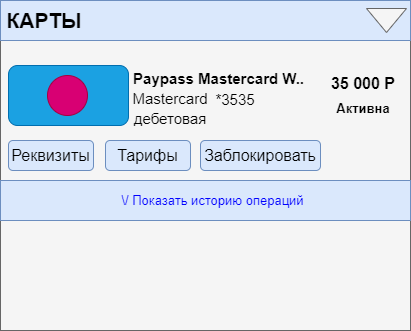

# 4.2.1 Блок “Карты”
## Макет блока
Pic. 2  

**SR-1**. Для отображения раздела Frontend инициирует вызов сервиса GET api/cards/list   
(без параметров|запрос не параметризован)  
**SR-2**. В случае если от сервиса получена ошибка или пустой ответ, отображается экран с ошибкой.  
Текст сообщения «Что-то пошло не так, но мы уже знаем о проблеме…»  
**SR-3**. В случае если получен успешный ответ, Frontend отображает форму с параметрами (Table 1):  
 
Table 1  

| **Поле**          | **Описание**                                                                                                                                                                                                               |
|-------------------|----------------------------------------------------------------------------------------------------------------------------------------------------------------------------------------------------------------------------|
| Блок с картами    | Содержит экземпляры data/cards[] ответа сервиса GET api/cards/list                                                                                                                                                         |
| **Элемент Карта**     |                                                                                                                                                                                                                            |
|   Иконка          | Значение data/cards/cardDesign ответа сервиса GET api/cards/list Если значение не получено, отображается иконка по-умолчанию                                                                                               |
|   Название карты  | Значение data/cards/name В поле отображается 100 символов. Если значение больше, то отображается только часть текста и троеточие. При наведение на такую строку полный текст должен отображаться во всплывающей подсказке. |
| Платежная система | Значение data/cards/paySystem                                                                                                                                                                                              |
|   Номер карты     | Значение data/cards/maskedNumber Отображается в формате \*XXXX, где XXXX - последние 4 цифры значения                                                                                                                      |
|   Тип карты       | Значение data/cards/cardtype В случае если получено значение · ‘debit’ отобразить текст «Дебетовая» · ‘credit’ – отобразить текст «Кредитная»                                                                              |
|   Баланс          | Значение data/cards/balance По-умолчанию отображается зеленым цветом В случае если значение отрицательное - отображается красным цветом                                                                                    |
|   Статус карты    | Если получено значение data/cards/status:  ‘active’ - отобразить значение “Активна”  ‘blocked’- отобразить значение “Заблокирована”  ‘inactive’ - отобразить значение “Требует активации”                                     |

**SR-3**. Под каждой картой отображаются действия, доступные с картой:  
Table 2

| **Действие**     | **Описание**                                                                                                                                                                                              |
|------------------|-----------------------------------------------------------------------------------------------------------------------------------------------------------------------------------------------------------|
| Реквизиты        | tbd                                                                                                                                                                                                   |
| Тарифы           | tbd                                                                                                                                                                                                       |
| Заблокировать    | tbd                                                                                                                                                                                                       |
| История операций | см. Раздел [История операций](4.2.2_OperationHistory.md)  Элемент представлен ссылкой. По нажатию на ссылку появляется раскрывающийся вниз блок Заголовок блока меняется в зависимости от раскрытия: “Показать/Скрыть историю операций” |
