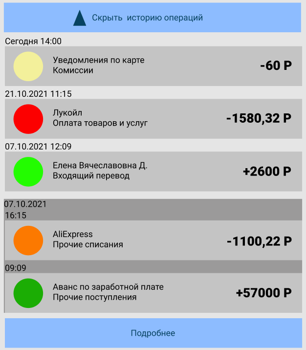

# 4.2.2 Блок История операций

##Макет Блока
Pic. 3  

**SR-1**. Для отображения блока Frontend инициирует вызов сервиса GET api/cards/history с
параметрами:

- _enddate_ заполнен значением текущей даты на момент осуществления запроса;
- _begindate_ заполнен значением даты enddate минус 10 дней;
- _numberOfOps_ заполнено значением 100 (данный параметр является настраиваемым в
файле конфигурации);
- _cards_ заполнено значением masked_number выбранной карты.

**SR-2**.В случае если от сервиса получена ошибка, в блоке отображается ошибка с текстом
сообщения «Что-то пошло не так, но мы уже знаем о проблеме…».

**SR-3**.В случае, если от сервиса получен пустой список операций по выбранной карте, в
блоке отображается текст сообщения «Операций по карте не найдено».

**SR-4**. В случае если получен успешный ответ со списком операций по выбранной карте,
Frontend формирует запрос к внешнему сервису, содержащему контент по
зарегистрированным торговым точкам для получения иконок и наименований
мерчантов, используя список значений из data/cards/history/mcc операций.

Frontend отображает форму с параметрами:
 
Table 3  

| **Поле**                             | **Описание**                                                                                                                                                                                                                                                                                                                                                                                                                                                        |
|--------------------------------------|---------------------------------------------------------------------------------------------------------------------------------------------------------------------------------------------------------------------------------------------------------------------------------------------------------------------------------------------------------------------------------------------------------------------------------------------------------------------|
| Краткая история операций по карте    | Содержит экземпляры data/cards/history[] ответа сервиса GET api/cards/history, отсортированные по дате от новых к старым. На экран выводятся 5 последних элементов массива.                                                                                                                                                                                                                                                                                         |
| **Элемент операция по карте**            |                                                                                                                                                                                                                                                                                                                                                                                                                                                                     |
| Дата                                 | Значение data/cards/history/transactionDate ответа сервиса GET api/cards/history в формате dd.mm.yyyy, с учетом <a href="#sr5">требования к группировке SR-5</a>                                                                                                                                                                                                                                                                                                 |
|   Иконка мерчанта                    | Отображается иконка мерчанта, полученная от внешнего сервиса.   Если значение data/cards/history/mcc не определено или не получено, проверяется значение data/cards/history/operType в зависимости от которого назначается иконка по умолчанию для типа операции.                                                                                                                                                                                                     |
|  Название операции/название мерчанта | Отображается наименование мерчанта, полученное от внешнего сервиса.   Если значение data/cards/history/mcc не определено или не получено, проверяется значение data/cards/history/operType в зависимости от которого назначается название операции(«Прочие начисления», «Прочие списания», «Комиссии» и т.д.)                                                                                                                                                         |
| Знак операции                        | Отображается слева от суммы операции.   Значение «+» отображается, если в ответе сервиса GET api/cards/history пришло 'Debit'.   Значение «-» отображается, если в ответе сервиса GET api/cards/history пришло 'Credit'.                                                                                                                                                                                                                                                |
|   Сумма операции                     | Проверяются значения data/cards/history/authCurrency и data/cards/history/transactionCurrency ответа сервиса GET api/cards/history.   Если значения совпадают, выводится сумма операции из data/cards/history/authAmount.   Иначе формируется запрос во внешний сервис для получения сконвертированной суммы операции в валюте карты, содержащий параметры:   - data/cards/history/authAmount  - data/cards/history/authCurrency  - data/cards/history/transactionCurrency |
|   Валюта                             | Отображается справа от суммы операции в виде значения data/cards/history/transactionCurrency из ответа сервиса GET api/cards/history                                                                                                                                                                                                                                                                                                                                |

**SR-5**. В отображаемом списке операций элементы группируются по дням совершения транзакций, отображаясь в виде отдельных блоков. Если транзакций за конкретный день больше одной, дата указывается только в верхней части блока, а в элементах отдельных операций указывается время совершения операции. Если операция за конкретную дату только одна, то в верхней части блока указывается дата и время совершения операции. Для блока с операциями текущего дня вместо даты в верхней части блока отображается текст «Сегодня».
**SR-6**. Для каждой операции доступно действие по нажатию на операцию:
 
Table 5  

| **Действие**    | **Описание** |
|-----------------|--------------|
| Детали операции | tbd          |

**SR-7**. Для блока в целом доступно действие:
 
Table 6  

| **Действие** | **Описание**                                                                                                                                                                   |
|--------------|--------------------------------------------------------------------------------------------------------------------------------------------------------------------------------|
| Подробнее    | см. Раздел [ЭФ Подробная история операций](4.2.3_FullOperationHistory.md).   Элемент представлен кнопкой в нижней части блока. По нажатии на кнопку «Подробнее» открывается Экранная форма подробной истории операций |
