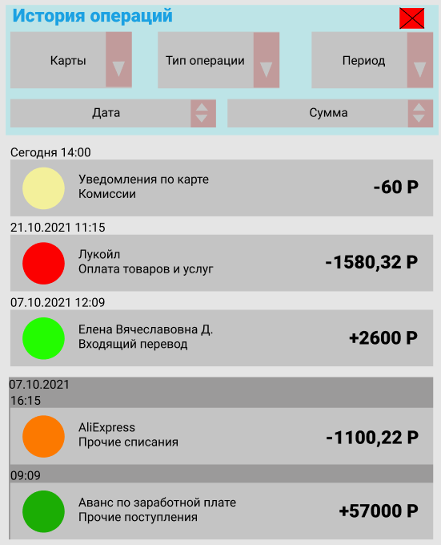

# 4.2.3 ЭФ Подробная история операций

## Макет ЭФ
Pic. 4  

**SR-1**. Для отображения ЭФ Frontend инициирует вызов сервиса GET api/cards/history с
параметрами:
- enddate заполнен значением текущей даты на момент осуществления запроса;
- begindate заполнен значением даты начала текущего месяца;
- numberOfOps заполнено значением 100 (данный параметр является настраиваемым в
файле конфигурации);
- cards принимает значение masked_number выбранной карты.

**SR-2**. На данной экранной форме отображаются экземпляры data/cards/history[] из сервиса
GET api/cards/history.

**SR-3**. В случае если получен успешный ответ со списком операций по выбранной карте,
Frontend формирует запрос к внешнему сервису, содержащему контент по
зарегистрированным торговым точкам для получения иконок и наименований
мерчантов, используя список значений из data/cards/history/mcc операций.

Frontend отображает форму с параметрами:
 
Table 7  

| **Элемент**                          | **Описание**                                                                                                                                                                                                                                                                                                                                                                                                                                                                                                             |
|--------------------------------------|--------------------------------------------------------------------------------------------------------------------------------------------------------------------------------------------------------------------------------------------------------------------------------------------------------------------------------------------------------------------------------------------------------------------------------------------------------------------------------------------------------------------------|
| Заголовок формы                      | Отображается значение «История операций» из кода фронта.                                                                                                                                                                                                                                                                                                                                                                                                                                                                 |
| Иконка «x»                           | Отображается в правом верхнем углу формы. При нажатии на иконку происходит переход к предыдущему экрану.                                                                                                                                                                                                                                                                                                                                                                                                                 |
| **Блок фильтрации операций**             |                                                                                                                                                                                                                                                                                                                                                                                                                                                                                                                          |
| Выпадающее меню для выбора карт      | По умолчанию заполнено значением карты, с которой произведен переход из краткой истории операций. По нажатию на элемент «Карты» открывается выпадающий список, состоящий из списка карт клиента. Список содержит экземпляры data/cards/list ответа сервиса GET api/cards/list. Возможен множественный выбор карт. При закрытии меню вызывается сервис GET api/cards/history в соответствие с требованием <a href="#sr5">вызов сервиса SR-4</a>                                                        |
| Меню выбора периода                  | По умолчанию выбран период с первого числа текущего месяца по текущую дату. По нажатию на элемент выбора периода открывается стандартная форма выбора периода. При закрытии меню вызывается сервис GET api/cards/history в соответствие с требованием <a href="#sr5">вызов сервиса SR-4</a>                                                                                                                                                                                                           |
| Меню выбора типа операций            | По умолчанию отмечены операции всех типов. По нажатию на элемент выбора типа операций открывается выпадающий список, состоящий из возможных типов операций. Список содержит экземпляры data/cards/history/operType сервиса GET api/cards/history. Возможно снятие флагов на вывод типов операций, флаг с единственно оставшегося типа операции не снимается. При закрытии меню фронт фильтрует список операций, полученный ранее сервисом GET api/cards/history в соответствии с указанными типами и отображает клиенту  |
| Блок сортировки по дате              | По умолчанию фронт сортирует операции по дате от новых к старым. При нажатии на элемент сортировки даты «стрелка вверх» фронт производит сортировку записей истории операций от старых к новым. При нажатии на элемент сортировки даты «стрелка вниз» фронт производит сортировку записей истории операций от новых к старым.                                                                                                                                                                                            |
| Блок сортировки по сумме операции    | По умолчанию сортировка по сумме не производится, операции отображаются отсортированными по дате При нажатии на элемент сортировки по сумме «стрелка вверх» фронт производит сортировку записией истории операций от меньшей суммы к большей. При нажатии на элемент сортировки по сумме «стрелка вниз» фронт производит сортировку записией истории операций от большей суммы к меньшей.                                                                                                                                |
| **Элемент операция по карте**            |                                                                                                                                                                                                                                                                                                                                                                                                                                                                                                                          |
| Дата                                 | Значение data/cards/history/transactionDate ответа сервиса GET api/cards/history в формате dd.mm.yyyy hh:mm, с учетом <a href="#sr5">требования к группировке SR-5</a>                                                                                                                                                                                                                                                                                                                                                 |
|   Иконка мерчанта                    | Отображается иконка мерчанта, полученная от внешнего сервиса. Если значение data/cards/history/mcc не определено или не получено, проверяется значение data/cards/history/operType в зависимости от которого назначается иконка по умолчанию для типа операции.                                                                                                                                                                                                                                                          |
|  Название операции/название мерчанта | Отображается наименование мерчанта, полученное от внешнего сервиса. Если значение data/cards/history/mcc не определено или не получено, проверяется значение data/cards/history/operType в зависимости от которого назначается название операции(«Прочие начисления», «Прочие списания», «Комиссии» и т.д.)                                                                                                                                                                                                              |
| Знак операции                        | Отображается слева от суммы операции. Значение «+» отображается, если в ответе сервиса GET api/cards/history пришло 'Debit'. Значение «-» отображается, если в ответе сервиса GET api/cards/history пришло 'Credit'.                                                                                                                                                                                                                                                                                                     |
|   Сумма операции                     | Проверяются значения data/cards/history/authCurrency и data/cards/history/transactionCurrency ответа сервиса GET api/cards/history. Если значения совпадают, тогда выводится сумма операции из data/cards/history/authAmount. Иначе формируется запрос во внешний сервис для получения суммы опереции в валюте карты содержащий параметры:  - data/cards/history/authAmount - data/cards/history/authCurrency - data/cards/history/transactionCurrency                                                                   |
|  Валюта                              | Отображается справа от суммы операции в виде значения data/cards/history/transactionCurrency из ответа сервиса GET api/cards/history                                                                                                                                                                                                                                                                                                                                                                                     |

**SR-4**. При изменении значений в элементах выбора карт и периода, вызывается сервис GET
api/cards/history с заполненными параметрами:
- begindate заполнен значением даты начала выбранного пользователем периода и
временем 00:00;
- enddate заполнен значением даты конца выбранного пользователем периода и
временем 23:59;
- numberOfOps заполнен значением максимально выводимого количества записей
операций, по умолчанию значение 100 (данный параметр является настраиваемым в
файле конфигурации);
- cards принимает значения массива выбранных пользователем карт.

**SR-5**. В отображаемом списке операций элементы группируются по дням совершения
транзакций, отображаясь в виде отдельных блоков. Если транзакций за конкретный
день больше одной, дата указывается только в верхней части блока, а в элементах
отдельных операций указывается время совершения операции. Если операция за
конкретную дату только одна, то в верхней части блока указывается дата и время
совершения операции. Для блока с операциями текущего дня вместо даты в верхней
части блока отображается текст «Сегодня».

**SR-6**. Для каждой операции доступно действие по нажатию на операцию:
 
Table 8  

| **Действие**    | **Описание** |
|-----------------|--------------|
| Детали операции | tbd          |
