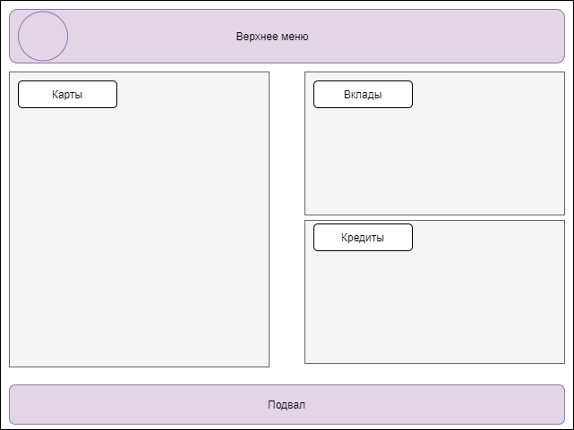

# 4.2 Список карт
**Цель:** документ описывает раздел «Список карт» и дополнительные формы, входящие в раздел.
## Общие требования к разделу
**SR-1**. По умолчанию раздел должен быть доступен при наличии у клиента флага доступа flag_cardlist == true. Иначе раздел не отображается.  
**SR-2**. Раздел доступен всем клиентам ДБО. Раздел открывается сразу после входа в ДБО и является частью «Главного экрана».  
### Макет раздела
Pic. 1  
 

