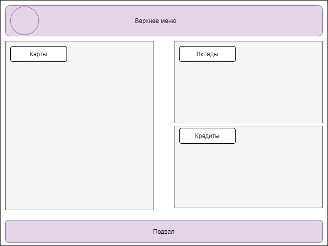
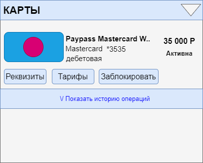
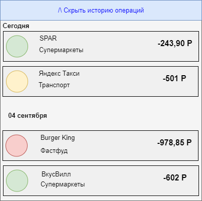

# 4.3 Frontend_Список карт и детали по карте
**Цель**: документ описывает раздел «Список карт», и дополнительные формы, входящие в раздел.

## 1. История изменений
| Автор         | Дата изменения | Версия изменений | Описание | Задача |
|---------------|----------------|------------------|----------|--------|
| Малышева Н.С. |15.09.2021 |1.0|Исходная версия документа|TASK-1|
| Пименова Т.В. |21.04.2022|1.1|Добавлена краткая и полная история операций по карте|

## 2. Ссылка на дизайн
TBD

## 3. Общие требования к разделу
Раздел доступен всем клиентам ДБО. Раздел открывается сразу после входа в ДБО и является 
частью «Главного экрана».

### 3.1 Макет раздела

## 4. Блок «Карты»
Для отображения раздела Frontend инициирует вызов сервиса GET api/cards/list (запрос не
параметризован).

В случае если от сервиса получена ошибка или пустой ответ, отображается экран с ошибкой.
Текст сообщения «Что-то пошло не так, но мы уже знаем о проблеме…».

В случае если получен успешный ответ, Frontend отображает форму с параметрами:

| Поле                | Описание                                                                                                                                                                                                                            |
|---------------------|-------------------------------------------------------------------------------------------------------------------------------------------------------------------------------------------------------------------------------------|
| Блок с картами      | Содержит экземпляры data/cards[] ответа сервиса GET api/cards/list                                                                                                                                                                  |
| Элемент Карта       |                                                                                                                                                                                                                                     | 
| - Иконка            | Значение data/cards/cardDesign  Если значение не получено, отображается иконка по-умолчанию                                                                                                                                     |
| - Название карты    | Значение data/cards/name  В поле отображается 100 символов. Если значение больше, то отображается только часть текста и троеточие.  При наведении на такую строку полный текст должен отображаться во всплывающей подсказке |
| - Платежная система | Значение data/cards/paySystem                                                                                                                                                                                                       |
| - Номер карты       | Значение data/cards/maskedNumber  Отображается в формате *XXXX, где XXXX - последние 4 цифры значения                                                                                                                           |
| - Тип карты         | Значение data/cards/cardtype  В случае если получено значение:  • ‘debit’ отобразить текст «Дебетовая»  • ‘credit’ отобразить текст «Кредитная»                                                                         |
| - Баланс            | Значение data/cards/balance  По-умолчанию отображается зеленым цветом.  В случае если значение отрицательное - отображается красным цветом                                                                                  |
| - Статус карты      | Если получено значение data/cards/status:  • ‘active’ - отобразить значение «Активна»  • ‘blocked’- отобразить значение «Заблокирована»  • ‘inactive’ - отобразить значение «Требует активации»                         |

Под каждой картой отображаются действия, доступные с картой:

|Действие|Описание|
|--------|--------|
|Реквизиты|tbd|
|Тарифы|tbd|
|Заблокировать|tbd|
|История операций|см. Раздел История операций  Элемент представлен ссылкой.  По нажатию на ссылку появляется раскрывающийся вниз блок  Заголовок блока меняется в зависимости от раскрытия: «Показать/Скрыть историю операций»|

## 5. Краткая история операций
При нажатии в блоке «Карты» на ссылку «Показать историю операций» появляется раскрывающийся
вниз блок «Краткая история операций по карте».

Требования к отображению краткой истории:
1. операции должны отображаться блоками, сгруппированными по дате совершения операции:
    * если нужно отобразить операции, совершенные за текущие сутки, то вместо даты должно отображаться название «Сегодня»;
    * если за предыдущие сутки, то – «Вчера»;
    * во всех остальных случаях в блоке указывается точная дата совершения операции в формате <день><месяц прописью на выбранном языке>.

Для отображения раздела Frontend инициирует вызов сервиса GET api/cards/{cardId}/operations.

В случае если от сервиса получена ошибка или пустой ответ, отображается экран с ошибкой. Выводится текст ошибки, полученный от сервиса.

В случае если получен успешный ответ, Frontend отображает форму с параметрами:

| Поле                             | Описание                                                                                                                                    |
|----------------------------------|---------------------------------------------------------------------------------------------------------------------------------------------|
| Блок с краткой историей операций | Содержит экземпляры data/operations[] ответа сервиса GET api/card/operations                                                                |
| Элемент Дата                     | Значение data/operations/date интерпретируется в соответствии с требованиями к отображению выше.                                            |
| Элемент Операция                 |                                                                                                                                             |
| - Иконка                         | Значение data/operations/icon  Если значение не получено, отображается иконка по-умолчанию                                              |
| - Название пункта обслуживания   | Значение data/operations/place  В поле отображается 50 символов. Если значение больше, то отображается только часть текста и троеточие. |
| - Категория операции             | Значение data/operations/category                                                                                                           |
| - Сумма операции                 | Конкатенация значений:  • data/operations/sign  • data/operations/amount  • data/operations/currency                            |

В начале блока с краткой историей операций отображаются доступные действия:

|Действие|Описание|
|--------|--------|
|Полная история операций|см. Раздел Полная история операций  Элемент представлен кнопкой.  По нажатию на кнопку открывается раздел Полная история операций по карте|

## 6. Полная история операций
При нажатии в блоке «Краткая история операций» на кнопку «Полная история операций» открывается форма «Полная история операций».

Требования к отображению полной истории:
1. имеется возможность фильтрации операций по дате совершения операции;
2. по умолчанию отображаются все операции за текущий месяц;
3. фильтр по дате предоставляет пользователю возможность выбора дат:
    * из выпадающего календаря,
    * путем введения даты с клавиатуры;
4. имеется возможность сортировки операций:
    * по дате совершения операции от старых к новым,
    * по дате от новых к старым, 
    * по уменьшению суммы операции, 
    * по увеличению суммы операции;
5. операции должны отображаться блоками, сгруппированными по дате совершения операции:
    * если нужно отобразить операции, совершенные за текущие сутки, то вместо даты должно отображаться название «Сегодня»;
    * если за предыдущие сутки, то – «Вчера»;
    * во всех остальных случаях в блоке указывается точная дата совершения операции в формате <день><месяц прописью на выбранном языке>.

Для отображения раздела Frontend инициирует вызов сервиса GET api/cards/{cardId}/operations.

В случае если от сервиса получена ошибка или пустой ответ, отображается экран с ошибкой. Текст сообщения «Операции по карте за указанный период отсутствуют».

В случае если получен успешный ответ, Frontend отображает форму с параметрами:

| Поле                            | Описание                                                                                                                                    |
|---------------------------------|---------------------------------------------------------------------------------------------------------------------------------------------|
| Блок с полной историей операций | Содержит экземпляры data/operations[] ответа сервиса GET api/card/operations                                                                |
| Элемент Дата                    | Значение data/operations/date интерпретируется в соответствии с требованиями к отображению выше.                                            |
| Элемент Операция                |                                                                                                                                             |
| - Иконка                        | Значение data/operations/icon  Если значение не получено, отображается иконка по-умолчанию                                              |
| - Название пункта обслуживания  | Значение data/operations/place  В поле отображается 50 символов. Если значение больше, то отображается только часть текста и троеточие. |
| - Категория операции            | Значение data/operations/category                                                                                                           |
| - Сумма операции                | Конкатенация значений:  • data/operations/sign  • data/operations/amount  • data/operations/currency                            |
