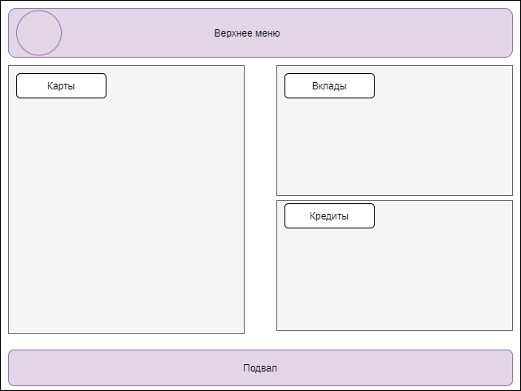
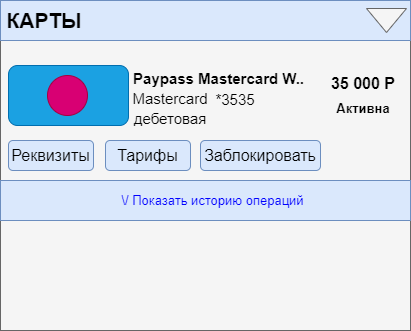
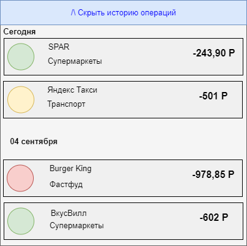

# **Пример\_готовый\_фронт**
# **Frontend\_Список карт и детали по карте**
**Цель:** документ описывает раздел «Список карт», и дополнительные формы, входящие в раздел.

Нажмите здесь для раскрытия... 
## **История изменений**

Автор|Дата изменения|Версия изменений|Описание|Задача
:------- | :--------------: | :----------------: | :--------: | --------:
[Малышева Надежда Сергеевна](D:/confl/display/~gapchenko)|15.09.2021|1.0|Draft|Исходная версия документа|TASK-1
## **Ссылка на дизайн**

## **Общие требования к разделу**
По-умолчанию раздел должен быть доступен при наличии у клиента флага доступа flag\_cardlist == true. Иначе, раздел не отображается.

Раздел доступен всем клиентам ДБО. Раздел открывается сразу после входа в ДБО и является частью «Главного экрана».
### **Макет раздела**
Нажмите здесь для раскрытия...

## **Блок “Карты”**
Для отображения раздела Frontend инициирует вызов сервиса GET api/cards/list (без параметров|запрос не параметризован)

В случае если от сервиса получена ошибка или пустой ответ, отображается экран с ошибкой. Текст сообщения «Что-то пошло не так, но мы уже знаем о проблеме…»

В случае если получен успешный ответ, Frontend отображает форму с параметрами:

|Поле|Описание| |
:--- | :------: |---:|
|Блок с картами|
Содержит экземпляры data/cards[] ответа сервиса GET api/cards/list
|
|Элемент Карта||
| |Иконка|
Значение data/cards/cardDesign ответа сервиса GET api/cards/list

Если значение не получено, отображается иконка по-умолчанию
|
| |Название карты|
Значение data/cards/name

В поле отображается 100 символов. Если значение больше, то отображается только часть текста и троеточие.

При наведение на такую строку полный текст должен отображаться во всплывающей подсказке.
|
| |Платежная система|Значение data/cards/paySystem|
| |Номер карты|
Значение data/cards/maskedNumber

Отображается в формате \*XXXX, где XXXX - последние 4 цифры значения
|
| |Тип карты|
Значение data/cards/cardtype

В случае если получено значение

·  ‘debit’ отобразить текст «Дебетовая»

· ‘credit’ – отобразить текст «Кредитная»
|
| |Баланс|
Значение data/cards/balance

По-умолчанию отображается зеленым цветом

В случае если значение отрицательное - отображается красным цветом
|
| |Статус карты|
Если получено значение data/cards/status:

- ‘active’ - отобразить значение “Активна”

- ‘blocked’- отобразить значение “Заблокирована”

- ‘inactive’ - отобразить значение “Требует активации”
|
Под каждой картой отображаются действия, доступные с картой:

|**Действие**|**Описание**|
| :--- | ---: |
|Реквизиты|
tbd

TODO
|
|Тарифы|tbd|
|Заблокировать|tbd|
|История операций|
см. Раздел История операций

Элемент представлен ссылкой.

По нажатию на ссылку появляется раскрывающийся вниз блок

Заголовок блока меняется в зависимости от раскрытия: “Показать/Скрыть историю операций”
|
## **История операций**
**Форма «Краткая история операций по карте»:**

1. Отображается при нажатии кнопки «Показать историю операций по карте» на блоке «Карты»
1. Для отображения истории Frontend инициирует вызов сервиса GET api/cards/transactions со следующими параметрами:
   1. Cardid просматриваемой карты;
   1. enddate ==сегодняшняя дата в формате yyyy-mm-dd;
   1. begindate == «сегодняшняя дата»-«10 дней» в формате yyyy-mm-dd;
   1. NumberOfOps == 5.
   1. При успешном ответе отображаются полученные операции по карте. Если таких операций нет, то отображается сообщение «За последние 10 дней операций не найдено»
   1. При неуспешном ответе отображается форма «Сервис временно недоступен»
1. Форма состоит из следующих элементов:
   1. Кнопка:
      1. В качестве значения используется «Скрыть историю операций»
      1. При нажатии происходит сворачивание списка операций
   1. Поле списка операций:
      1. Операции сгруппированы по дням в порядке уменьшения значения transaction-date;
      1. Каждая группа состоит из следующих элементов:
         1. Заголовок:
            1. По умолчанию используется значение transaction-date в формате «ДД месяц»;
            1. Если transaction-date == «сегодняшняя дата», то используется значение «Сегодня»;
            1. Если transaction-date == «сегодняшняя дата»-1 день, то используется значение «Вчера».
         1. Список транзакций:
            1. Каждая транзакция списка состоит из следующих элементов:
               1. Иконка транзакции:
                  1. Если oper\_type == IBN || POS || ACC, то производится поиск иконки мерчанта по **mcc** точки сервиса для отображения. При успешном поиске отображается иконка мерчанта;
                  1. В противном случае отображается иконка, соответствующая oper\_type.
               1. Заголовок:
                  1. В качестве значения используется значение из справочника в соответствии с **mcc**
                  1. В противном случае используется значение, соответствующее oper\_type.
               1. Название категории:
                  1. В качестве значения используется значение из справочника в соответствии с **mcc**
                  1. В противном случае используется значение, соответствующее oper\_type.
               1. Сумма операции:
                  1. В качестве знака операции используется;
                     1. «+» если card\_sign == Debit
                     1. «-» если card\_sign == Credit
                  1. В качестве значения используется значение auth\_amount в формате ХХХ ХХХ,ХХ
                  1. В качестве знака валюты используется знак валюты, соответствующий значению auth\_currency
   1. Кнопка для перехода к полной истории:
      1. В качестве значения используется текст «Показать полную историю»
      1. При нажатии происходит переход к форме «Полная история операций по карте»

**Форма «Полная история операций по карте»**

1. Отображается при нажатии кнопки «Полная история операций по карте» на форме «Краткая история операций по карте»
1. Для отображения истории Frontend инициирует вызов сервиса GET api/cards/transactions со следующими параметрами:
   1. Cardid просматриваемой карты;
   1. enddate ==сегодняшняя дата в формате yyyy-mm-dd;
   1. begindate == «сегодняшняя дата»-«1 месяц» в формате yyyy-mm-dd;.
   1. При успешном ответе отображаются полученные операции по карте. Если таких операций нет, то отображается сообщение «За последний месяц операций не найдено»
   1. При неуспешном ответе отображается форма «Сервис временно недоступен»
1. Форма состоит из следующих элементов:
   1. Поле выбора карт, по которым запрашиваются транзакции:
      1. По умолчанию выбрана карта, из краткой истории которой был выполнен переход;
      1. При нажатии появляется выпадающий список с картами, по которым возможно показать историю;
   1. Поле выбора периода проведённых транзакций:
      1. Состоит из даты начала и даты окончания периода, за который запрашивается информация;
      1. по умолчанию выбран период со значениями:
         1. Дата окончания периода, за который запрашивается информация – сегодняшняя дата;
         1. Дата начала периода, за который запрашивается информация – дата за месяц до сегодняшней даты
      1. При нажатии на каждую из дат отображается календарь для выбора даты
   1. Кнопка поиска:
      1. В качестве значения используется текст «Поиск»;
      1. При нажатии производится вызов сервиса GET api/cards/transactions со следующими параметрами:
         1. Cardid выбранных карт;
         1. enddate == выбранная дата окончания периода, за который запрашивается информация;
         1. begindate == выбранная дата начала периода, за который запрашивается информация.
   1. Поле списка операций:
      1. Операции сгруппированы по дням в порядке уменьшения значения transaction-date;
      1. Каждая группа состоит из следующих элементов:
         1. Заголовок:
            1. По умолчанию используется значение transaction-date в формате «ДД месяц»;
            1. Если transaction-date == «сегодняшняя дата», то используется значение «Сегодня»;
            1. Если transaction-date == «сегодняшняя дата»-1 день, то используется значение «Вчера».
         1. Список транзакций:
            1. Каждая транзакция списка состоит из следующих элементов:
               1. Иконка транзакции:
                  1. Если oper\_type == IBN || POS || ACC, то производится поиск иконки мерчанта по **mcc** точки сервиса для отображения. При успешном поиске отображается иконка мерчанта;
                  1. В противном случае отображается иконка, соответствующая oper\_type.
               1. Заголовок:
                  1. В качестве значения используется значение из справочника в соответствии с **mcc**
                  1. В противном случае используется значение, соответствующее oper\_type.
               1. Название категории:
                  1. В качестве значения используется значение из справочника в соответствии с **mcc**
                  1. В противном случае используется значение, соответствующее oper\_type.
               1. Сумма операции:
                  1. В качестве знака операции используется;
                     1. «+» если card\_sign == Debit
                     1. «-» если card\_sign == Credit
                  1. В качестве значения используется значение auth\_amount в формате ХХХ ХХХ,ХХ
                  1. В качестве знака валюты используется знак валюты, соответствующий значению auth\_currency
   1. Кнопка возврата в предыдущее меню
      1. В качестве значения используется текст «Назад»
      1. При нажатии происходит переход к форме «Краткая история операций»
