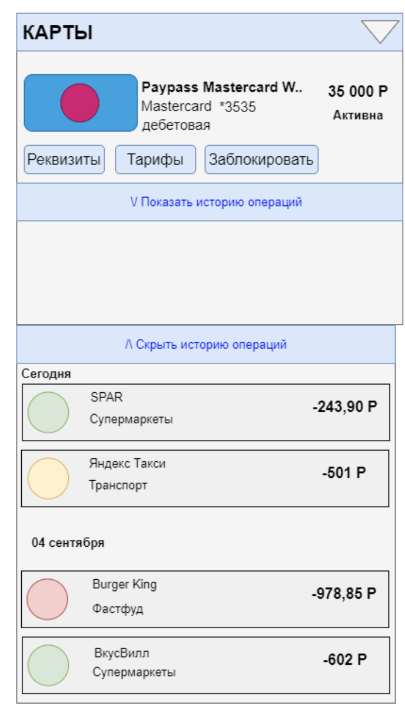
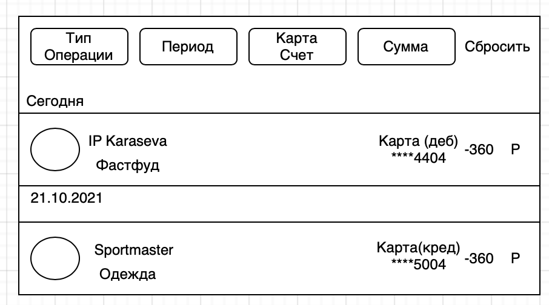


#Frontend\_Список карт и детали по карте
Цель:документ описывает раздел «Список карт», и дополнительные формы, входящие в раздел.
##Макет
##(
##(
##Общие требования
По-умолчанию раздел должен быть доступен при наличии у клиента флага доступа flag\_cardlist == true. Иначе, раздел не отображается. Раздел доступен всем клиентам ДБО. Раздел открывается сразу после входа в ДБО и является частью «Главного экрана». Блок “Карты”
##Блок “Карты”

Для отображения раздела Frontend инициирует вызов сервиса GET api/cards/list (без параметров|запрос не параметризован)

В случае если от сервиса получена ошибка или пустой ответ, отображается экран с ошибкой. Текст сообщения «Что-то пошло не так, но мы уже знаем о проблеме…»

В случае если получен успешный ответ, Frontend отображает форму с параметрами:

| Поле     | Описание  | 
| ------------- |------------------|
| Блок с картами| Содержит экземпляры data/cards[] ответа сервиса GET api/cards/list
 |
|Элемент Карта   | 
` `Действия:

1)    Реквизиты

2)    Заблокировать

3)    Тарифы

4)    История операций 
|| 
| 1. Иконка|
Значение data/cards/cardDesign 

Если значение не получено, отображается иконка по-умолчанию
|
|2. Название карты|
Значение data/cards/name

В поле отображается 100 символов. Если значение больше, то отображается только часть текста и троеточие.

При наведении на такую строку полный текст должен отображаться во всплывающей подсказке.
|
|3. Платежная система|Значение data/cards/paySystem|
|4. Номер карты|
Значение data/cards/maskedNumber

Отображается в формате \*XXXX, где XXXX - последние 4 цифры значения
|
|5. Тип карты|
Значение data/cards/cardtype

В случае если получено значение

·        ‘debit’ отобразить текст «Дебетовая»

·        ‘credit’ – отобразить текст «Кредитная»
|
|6. Баланс|
Значение data/cards/balance

По-умолчанию отображается зеленым цветом

В случае если значение отрицательное - отображается красным цветом
|
|7. Статус карты|
Если получено значение data/cards/status:

- ‘active’ - отобразить значение “Активна”

- ‘blocked’- отобразить значение “Заблокирована”

- ‘inactive’ - отобразить значение “Требует активации”
|
Под каждой картой отображаются действия, доступные с картой:

|Действие | Описание |
| ------------- |------------------|
|Реквизиты|
tbd

TODO
|
|Тарифы|tbd|
|Заблокировать|tbd|
|История операций|
см. Раздел История операций

Элемент представлен ссылкой.

По нажатию на ссылку появляется раскрывающийся вниз блок

Заголовок блока меняется в зависимости от раскрытия: “Показать/Скрыть историю операций”

##Раздел История операций по картам

Для отображения раздела “История операций по карте” пользователю необходимо перейти по ссылке, в этом случае Frontend инициирует вызов сервиса GET data/cards/operations, где параметр запроса является id карты.

Если операций по карте не совершалось за последние 10 дней, клиенту должно отобразиться сообщение “За последние 10 дней операций по карте не совершалось”.

В случае если получен успешный ответ, Frontend отображает форму c операциями за последние 10 дней, но не больше, чем 5 записей с параметрами:

|Поле|Описание|
| ------------- |------------------|
|Блок “ История операций по карте”|
Содержит экземпляры data/cards/operations [] ответа сервиса  GETapi/cards/operations где параметр запроса является id карты.

Действия:

1)    Полная история операций
|
|Элемент Общая История операций по карте| |
| Дата операции|
Значение data/cards/operations/transaction\_date[]

ответа сервиса GET api/operations

Отображается в формате день и наименование месяца. 

В случае если получено значение

·        ‘date == today()’ отобразить текст «Сегодня»

`           `‘date == today()-1’ отобразить текст «Вчера»
|
| Название операции|
Значение data/cards/operation/description

ответа сервиса GET api/operations

В случае если получено значение

·      IBN – отобразить “оплата услуг”

·      POS – отобразить  “выдача кредита”

·      ATM – отобразить  “выдача/прием наличных средств”

·      BAL – отобразить “запрос балансы карты“

·      KOM – отобразить “комиссия”

·      KAS – наличные 

·      АСС – отобразить  “перевод по счету“
|
| Название мерчанта|
Значение data/cards/operations/mcc 

Отображается согласно значению параметра  
|
| Валюта операции|
data/cards/operations/auth\_currency

Отображается согласно значению параметра  
|
| Cумма операции|
Значение data/cards/operations/transaction\_amount

По-умолчанию отображается черным цветом
|
|Категория операции|
Значение data/cards/operations/oper\_type

ответа сервиса GET cards/list/mcc

По-умолчанию отображается серым цветом.

В поле отображается 15 символов. Если значение больше, то отображается только часть текста и троеточие.

При наведении на такую строку полный текст должен отображаться во всплывающей подсказке.
|
| ` `Иконка операции|
Значение data/cards/categoryDesign ответа сервиса GET data/cards/operations/oper\_type или data/cards/operations/mcc

Если значение не получено, отображается иконка по-умолчанию
|

После окончания списка операций по карте клиенту доступна ссылка “Просмотр Общей Истории операций по картам”. 

|**Действие**|**Описание**|
| ------------- |------------------|
|Переход к общей Истории операций по картам|
см. Раздел Общая История операций

Элемент представлен ссылкой.

По нажатию на ссылку открывается новое окно, где отображаются операции за текущий месяц. 

 
|

## Раздел Общая история операций

Для отображения раздела пользователю необходимо перейти по ссылке “Общая история операций”, в этом случае Frontend инициирует вызов сервиса GET data/cards/operations (без параметров|запрос не параметризован)

Если операций по карте не совершалось за последний месяц, клиенту должно отобразиться сообщение “За текущий месяц операция не совершалось”. 

В случае если получен успешный ответ, Frontend отображает форму c операциями за последний месяц. 

|*Поле*|**Описание**|
| ------------- |------------------|
|Блок “Общая История операции”|Содержит экземпляры data/cards/operations[] ответа сервиса GET api/cards/operations|
|
Элемент 

Фильтрация/Сортировка транзакций
|
Действия: 

·      Тип Операции

·      Период

·      Карта/Счет

·      Сумма

·      Сброс
|
 |Тип операции|
Значение cards/operations/oper\_type[]

ответа сервиса GET cards/list/oper\_type

При нажатии на кнопку отображается в формате списка чекбоксов
|
|Период|
Значение data/cards/operations/begindate

Значение data/cards/operations/enddate

Отображается в формате календаря
|
|Карта/Счет|
Значение data/cards/list/cardnumber[]

ответа сервиса GET api/cards/list

Отображается в формате списка чекбоксов 
|
|Сумма|
Значение data/cards/list/auth\_amount

Отображается в формате выбора параметром 

-Сортировать по убыванию

-Сортировать по возрастанию
|
|Элемент История операций по карте| |
|Дата и совершения операции|
Значение data/cards/operations/begindate

Значение data/cards/operationsenddate

ответа сервиса GET api/cards/operations

Отображается в формате день и наименование месяца. 

В случае если получено значение

·        ‘date == today()’ отобразить текст «Сегодня»
|
|Наименование карты/счета|
Значение data/cards/operations/card\_number

Отображается в формате последних 4 цифр карты/счета 
|
|Название операции/мерчанта|
Значение data/cards/operations/nameOperations

В поле отображается 30 символов. Если значение больше, то отображается только часть текста и троеточие.

При наведении на такую строку полный текст должен отображаться во всплывающей подсказке.
|
|Валюта операции|Отображается согласно значению параметра data/cards/operations/currency\_auth|
|Cумма операции|
Значение data/cards/operations/transaction\_amount

По-умолчанию отображается черным цветом
|
|Категория операции|
Значение data/cards/operations/oper\_type

По-умолчанию отображается серым цветом.
|
|Иконка операции|
Значение data/cards/categoryDesign ответа сервиса GET api/cards/operations/category

Если значение не получено, отображается иконка по-умолчанию
|
|||||

Над формой отображаются действия, доступные с картой:

|**Действие**|**Описание**|
| ------------- |------------------|
|Тип операции|
Элемент представлен списком

При выборе параметров происходит фильтрация данных по выбранным параметрам операции. 
|
|Период|
Элемент представлен календарем 

При выборе параметров происходит фильтрация данных по дате совершения операций.
|
|Карта/Счет|
Элемент представлен списком

При выборе параметров происходит фильтрация данных по выбранным счетам и картам.
|
|Сумма|
Элемент представлен списком

Происходит сортировка по возрастанию, или убыванию сумм транзакций
|
|Сброс|Сбрасывает параметры запроса фильтрации и сортировки|

# **История изменений**

|**Автор**|**Дата изменения**|**Версия изменений**|**Описание**|**Задача**|
| ------------- |------------------|------------------|------------------|------------------|
|
Малышева Н.С.

Малышева Надежда Сергеевна
|15.09.2021 |1.0|Draft|Исходная версия документа|TASK-1|
|Рыболовлева А.В |22.09.2021|1.1|1.Добавление разделов -Краткая история операций-Общая история операций 
-Фильтрация операций по категориям
-Сортировка операций по дате, сумме|TASK-2|

