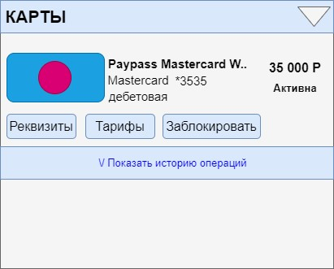
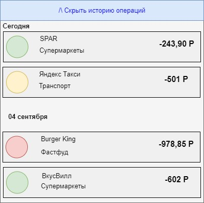

### Цели:
- Составление списка доработок
- Разработка артефактов исходя из составленных доработок

## Тема: История операций по карте ##
 
Декомпозиция задачи:
- Требования к фронту ИБ -  реализовать новый раздел, в котором будет отображаться история операций клиента. Внутри каждой карты должна отображаться история операций по ней.
- Требования к backIB -  реализовать сервис, который будет вызывать фронт, чтобы получить историю операций по картам с возможностью фильтрации и сортировки.
- Требования к интеграции между backIB и Cards -  описать маппинг параметров между сервисов бекенда и системы, в которой хранятся карты.
 

| Задача                     |                                                             Декомпозиция                                                             |      Открытые вопросы аналитики |
|:---------------------------|:------------------------------------------------------------------------------------------------------------------------------------:|--------------------------------:|
| Истории операций по картам |                                         Требование к интеграции  - Документация «Cards»                                          | Документация «Cards» 14.04.2022 |
|                            |                                            Фронт  - Фильтрация краткой/полной истории                                            |                                 |
|                            |                             Разработка ЭФ «История операций»  - Создание дизайна  - Согласование                             |                                 |
|                            | Бэк  - Создание фильтров по типам операций, категориям, суммам  - Сортировка по датам  - БД с историей по операциям карт |                                 |

## Frontend_ История операций ##
#### Цель: документ описывает раздел «История операций»
###### История изменений
| Автор          | Дата изменения | Версия изменений |                        Описание | Задача |
|:---------------|:--------------:|-----------------:|--------------------------------:|-------:|
| Васильева Н.А. |   14.04.2022   |            1.0.0 |       Исходная версия документа | TASK-1 |
| Васильева Н.А. |   01.05.2022   |            1.0.1 | Внесены изменения по замечаниям | TASK-2 |

#### Ссылка на дизайн
TBD
#### Общие требования к разделу
- Раздел доступен всем клиентам ДБО c картами. 
- В разделе «Карты» элемент представлен ссылкой.
- По нажатию на ссылку появляется раскрывающийся вниз блок.
- Заголовок блока меняется в зависимости от раскрытия: «Показать/Скрыть историю операций».

#### Макет раздела

#### Блок «Показать историю операций»
Для отображения раздела Frontend инициирует вызов сервиса GET api/cards/history (запрос параметризован) 
В случае если от сервиса получена ошибка или пустой ответ, отображается экран с ошибкой. Текст сообщения «Операций за данный период не найдено»
В случае если получен успешный ответ, Frontend отображает форму с параметрами:

| Поле                                | Описание                   |
|-------------------------------------|----------------------------|
| Дата и время совершения операции    | Значение /transaction_date |
| Название операции/название мерчанта | Значение /description      |
| Сумма и валюта операции             | Значение /auth_amount      |
| Категория операции                  | Значение /auth_currency    |

## API_Получение истории операций по карте

###### История изменений
| Автор          | Дата изменения | Версия изменений |                        Описание | Задача |
|:---------------|:--------------:|-----------------:|--------------------------------:|-------:|
| Васильева Н.А. |   14.04.2022   |            1.0.0 |       Исходная версия документа | TASK-1 |
| Васильева Н.А. |   01.05.2022   |            1.0.1 | Внесены изменения по замечаниям | TASK-2 |

### Цель: сервис предназначен для получения истории операций по карте клиента.
- **URL** : [endpoint]/api/cards/history
- **Метод**: GET 
- **Доступ**: авторизованная зона. Наличие карты у клиента. Сервис вызывается с фронта.
###### Входные параметры:   
| Параметр    | Тип поля | Описание                                                               | Обязательность |
|-------------|----------|------------------------------------------------------------------------|----------------|
| cardnumber  | String   | Виртуальный или полный номер карты                                     | M              |
| numberOfOps | Number   | Максимальное количество операций, которое нужно вернуть в ответ        | O              |
| enddate     | String   | Дата окончания периода за который запрашивается информация(yyyy-mm-dd) | M              |
| cardid3c    | Number   | ИД карты, используется как альтернатива cardnumber                     | M              |
| begindate   | String   | Дата начала периода за который запрашивается информация(yyyy-mm-dd)    | M              |

###### Выходные параметры:
| Параметр            | Тип поля | Описание                                                                                                                                                              | Обязательность |
|---------------------|----------|-----------------------------------------------------------------------------------------------------------------------------------------------------------------------|----------------|
| transactionDate     | DateTime | Дата операции                                                                                                                                                         | M              |
| authAmount          | Number   | Сумма операции в валюте транзакции                                                                                                                                    | M              |
| authCurrency        | String   | Валюта операции                                                                                                                                                       | M              |
| authorizationCode   | Number   | Код авторизации. Код, присвоенный Участником, разрешившим совершение операции.                                                                                        | O              |
| cardSign            | String   | Знак операции, принимает значения 'Debit' или 'Credit'                                                                                                                | O              |
| description         | String   | Назначение операции                                                                                                                                                   | M              |
| operType            | String   | Тип операции, IBN - оплата услуг в ИБ, POS - POS, ATM - наличка, BAL - платный запрос баланса карты, P2P - P2P, KOM - комиссия, KAS - наличка, ACC - перевод по счету | O              |
| status              | String   | Статус операции                                                                                                                                                       | O              |
| place               | String   | Параметры пункта обслуживания (название и город)                                                                                                                      | O              |
| transactionAmount   | Number   | Сумма операции в валюте карты                                                                                                                                         | M              |
| transactionCurrency | String   | Валюта карты                                                                                                                                                          | O              |

## Основной сценарий (MC)
1. Сервис проверяет входные параметры запроса: 
    * 1.1 Если получены параметры begindate == true и enddate == true, то переход к сценарию AC-1 - Получение полной истории операций из АБС Cards.
    * 1.2 Иначе, сценарий  продолжается.
2. Сервис выполняет загрузку операций по карте для текущего клиента в БД в таблице operations_card.
3. Если в таблице operations_card для данной карты клиента отсутствуют операций за последние 10 дней , то переход к сценарию AC-1 - Получение полной выписки из АБС Cards.
4. Сервис сортирует операций в порядке уменьшению даты.
5. Сервис формирует ответ согласно маппингу:

| Параметр ответа    | Правило формирования                                                                                                                                                                   |
|--------------------|----------------------------------------------------------------------------------------------------------------------------------------------------------------------------------------|
| data/cards/history | -                                                                                                                                                                                      |
| /transaction_date  | Значение client cards.transaction_date                                                                                                                                                 |
| /description       | Значение client  cards.description                                                                                                                                                     |
| /auth_amount       | Значение client  cards.auth_amount                                                                                                                                                     |
| /auth_currency     | Значение ₽ если в cardcurrencydesc получено значение ‘RUB’, Значение ‘$’ если в cardcurrencydesc получено значение ‘USD’, Значение ‘€’ если в cardcurrencydesc получено значение ‘EUR’ |
| /card_sign         | Значение client cards.card_sign                                                                                                                                                        |
| /status            | Значение client cards.status                                                                                                                                                           |

6. Сервис возвращает ответ вызывающей системе.
## Альтернативный сценарий (AC)
### АС-1. Получение полной выписки из АБС Cards
1. Сервис инициирует получение полной истории операции по карте клиента из operations_card, формируя запрос:

| Атрибут   | Описание                                                                    |
|-----------|-----------------------------------------------------------------------------|
| begindate | Значение begindate == true определено для истории операций конкретной карты |
| enddate   | Значение enddate == true определено для истории операций конкретной карты   |
2.	После получения ответа от бэк-системы, выполняется проверка, получена ли информация об операциях клиента:
   * 2.1. Если получен пустой ответ, ошибка или таймаут, то переход к сценарию ЕС-1
3.	По событию получения ответа, сервис сохраняет карты в БД в таблицу operations_card, согласно маппингу:

| Параметр ответа    | Правило формирования                                                                                                                                                          |
|--------------------|-------------------------------------------------------------------------------------------------------------------------------------------------------------------------------|
| data/cards/history | -                                                                                                                                                                             |
| /transaction_date  | Значение operations_card.transaction_date                                                                                                                                     |
| /description       | Значение operations_card.description                                                                                                                                          |
| /auth_amount       | Значение operations_card.auth_amount                                                                                                                                          |
| /auth_currency     | Значение ₽ если в auth_currency получено значение ‘RUB’, Значение ‘$’ если в auth_currency получено значение ‘USD’, Значение ‘€’ если в auth_currency получено значение ‘EUR’ |
| /card_sign         | Значение operations_card.card_sign                                                                                                                                            |
| /status            | Значение operations_card.status                                                                                                                                               |
4.	Сценарий продолжается с шага 4 Основного сценария – сортировки операций в порядке уменьшению даты.
## Исключительные сценарии (EC)
### ЕС-1. У клиента нет операций за указанный период
1. Сервис формирует ответ, согласно маппингу:

| Параметр ответа | Правило формирования                                   |
|-----------------|--------------------------------------------------------|
| data/error/code | Код ошибки                                             |
| data/error/text | Текст сообщения «Операций за данный период не найдено» |

2.	API возвращает ответ. 
### Паспорт задачи
##### Фронт: 
Добавлена кнопка скрытия баланса карты, разработана форма просмотра истории операций по картам краткая/полная
##### Бэк: 
Был доработан метод получения списка карт, разработан метод получения истории операций
