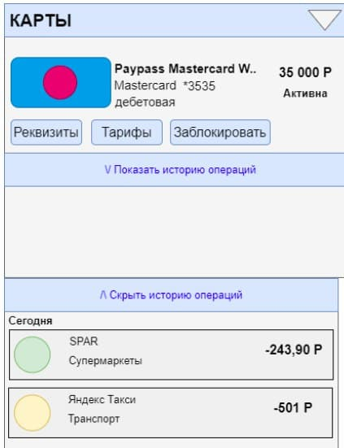

# Frontend_История операций по карте

**Цель**: документ описывает раздел «История операций по карте», и дополнительные формы, входящие в раздел.

## История изменений

<table border="1">
  <tr>
    <th>Автор</th>
    <th>Версия изменений</th>
    <th>Описание</th>
    <th>Задача</th>
  </tr>
  <tr>
    <td>Савастеева А.А.</td>
    <td>1.0</td>
    <td>Draft | Исходная версия документа</td>
    <td>TASK - 1</td>
    </tr>
</table>

## Примерный дизайн
Общая история операций

Краткая история операций

## Общие требования к разделу

По-умолчанию раздел должен быть доступен при наличии у клиента флага (flag_history_operation == true). Иначе, раздел не отображается.
Раздел доступен всем клиентам ДБО.

Раздел:
<ul>
<li>открывается сразу после входа в ДБО и является частью «Главного экрана».
<li>может быть открыт при нажатии на кнопку “История операций” при просмотре карты/счета.
</ul>

## Блок “История операций”

Для отображения раздела Frontend инициирует вызов сервиса GET api/cards/operations?id_card (id_card – необязательный параметр).

В случае если от сервиса получена ошибка или пустой ответ, отображается экран с ошибкой. Текст сообщения «Что-то пошло не так, но мы уже знаем о проблеме…»

В случае если получен успешный ответ, Frontend отображает список операций по соответствующей карте / картам.

В случае если получен успешный ответ, Frontend отображает форму с параметрами:

<table border="0.5">
  <tr>
    <th colspan = "2"> Поле</th>
    <th colspan = "1">Описание</th>
  </tr>

  <tr>
    <th colspan = "2">Блок опций</th>
    <th></th>
    
  </tr>

  <tr>
    <td></td>
    <td>Карта или счет</td>
    <td>При нажатии на данный раздел отображается выпадающий список с картами / счетами (иконка карты / счета, название и последние 4 цифры карты / счета). 

Содержит экземпляры data/cards[] и data/accounts[] ответа сервиса GET api/cards и GET api/accounts.

В выпадающем списке есть возможность выбора одной или нескольких карт / счетов и строка “выбрать все” </td>
  </tr>

  <tr>
    <td></td>
    <td>Категория</td>
    <td>При нажатии на данный раздел отображается выпадающий список с возможными категориями операций(иконка, название категории). 

Содержит экземпляры data/oper_type[] ответа сервиса GET api/oper_type

В выпадающем списке есть возможность выбора одной или нескольких категорий и строка “выбрать все” </td>
  </tr>

  <tr>
    <td></td>
    <td>Период</td>
    <td>При нажатии на данный раздел отображается выпадающий список с периодами : «за неделю», «за месяц», «за год» и «период…». 

При нажатии на последний, высвечивается календарь с возможностью выделять несколько дней удерживающимся нажатием. Окончание выбора происходит при нажатии кнопки “Подтвердить”. </td>
  </tr>

  <tr>
    <td></td>
    <td>Сумма</td>
    <td>При нажатии на данный раздел отображается поле с вводом суммы «от» … «до» </td>
  </tr>

   <tr>
    <td>Блок с историей операций</td>
    <td>Содержит экземпляры data/cards/operations[] ответа сервиса GET api/cards/operations?card_id</td>
    <td></td>
  </tr>

   <tr>
    <td colspan = "2"> Элемент Операция</td>
    <td>При нажатии на данный раздел отображается поле с вводом суммы «от» … «до» </td>
  </tr>

  <tr>
    <td></td>
    <td> Дата и время</td>
    <td>Значение data/operations/transaction_date
 </td>
  </tr>

  <tr>
    <td></td>
    <td> Название операции / мерчанта</td>
    <td>Значение data/operations/name

В поле отображается 20 символов. Если значение больше, то отображается только часть текста и троеточие и стрелочка ↓.

При нажатии на стрелочку раскрывается полный текст.
</td>
  </tr>

  <tr>
    <td></td>
    <td> Сумма</td>
    <td>Значение data/operations/auth_amount
 </td>
  </tr>

  <tr>
    <td></td>
    <td> Дата и время</td>
    <td>Значение data/operations/transaction_date
 </td>
  </tr>

  <tr>
    <td></td>
    <td> Валюта</td>
    <td>
Значение data/operations/ auth_currency
 </td>
  </tr>

  <tr>
    <td></td>
    <td> Категория</td>
    <td>
Значение data/operations/category
 </td>
  </tr>

  <tr>
    <td></td>
    <td>Иконка</td>
    <td>
Значение data/operations/operationDesign 

Если значение не получено, отображается иконка по-умолчанию
 </td>
  </tr>
</table>