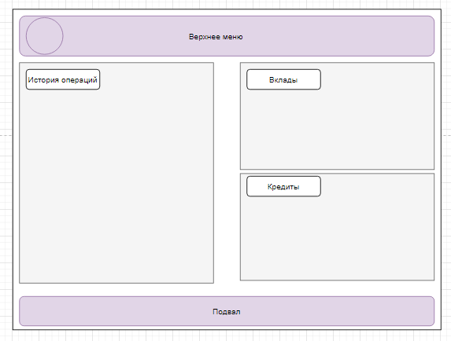
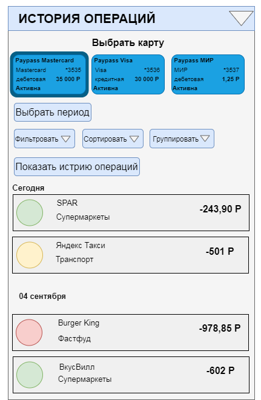

# Frontend_Вся история операций
**Цель**: документ описывает раздел «Все операции по картам»
 
### История изменений
|Автор|Дата изменения|Версия изменений|Описание|Задача|
|-----|--------------|----------------|--------|------|
|Обухова Л.М.|25.10.2021|	1.1	|Draft/Исходная версия документа|	TASK-1

### Общие требования к разделу
Раздел доступен из Раздела Карты (при нажатии на ссылку «Все операции по картам» под «История операций»). Раздел должен быть доступен при наличии у клиента флага доступа flag_cardlist == true. Иначе, раздел не отображается.
Раздел доступен всем клиентам ДБО.

#### Макет раздела

### Блок «Карты»
Для отображения блока Frontend инициирует вызов сервисов: GET api/cards/list и 
GET api/cards/history/list

|Поле|   |   |Описание|
|----|---|---|--------|
|Блок с картами	|  |  |Содержит экземпляры data/cards[] ответа сервиса GET api/cards/list.Доступны действия: выбрать одну или несколько карт начатием на карты. Выбранные карты подсвечиваются (отображается рамка вокруг карты)  
|  |  |  |Frontend инициирует вызов сервисов: GET api/cards/list В случае если от сервиса получена ошибка или пустой ответ, отображается экран с ошибкой. Текст сообщения «Что-то пошло не так, но мы уже знаем о проблеме…» В случае если получен успешный ответ, Frontend проверяет параметр data/cards/status. 
|  |  |  |Если параметр data/cards/status == ’active’ отображает форму для экземпляра data/cards. Иначе экземпляр data/cards не отображается|
|  |Текстовое поле|  |Значение «Выбрать карту»|
|  |Элемент Карта|  |Экземпляры data/cards[] отображаются по несколько штук в ряд (в зависимости от доступной ширины экрана).|
|  |  |Иконка|Значение data/cards/cardDesign ответа сервиса GET api/cards/list Если значение не получено, отображается иконка по умолчанию|
|  |  |Название карты|Значение data/cards/name. В поле отображается 30 символов. Если значение больше, то отображается только часть текста и троеточие. При наведение на такую строку полный текст должен отображаться во всплывающей подсказке. |
|  |  |Платежная система|Значение data/cards/paySystem|
|  |  |Номер карты|Значение data/cards/maskedNumber. Отображается в формате *XXXX, где XXXX - последние 4 цифры значения|
|  |  |Тип карты|Значение data/cards/cardtype. В случае если получено значение: ‘debit’ отобразить текст «Дебетовая»; ‘credit’ – отобразить текст «Кредитная»
|  |  |Баланс|Значение data/cards/balance. По умолчанию отображается зеленым цветом. В случае если значение отрицательное - отображается красным цветом|
|  |  |Статус карты|Если получено значение data/cards/status: ‘active’ - отобразить значение “Активна”|

### Блок «Действия»
|Поле|   |Описание|
|----|---|--------|
|Блок с действиями|   |	Отображает действия доступные для поиска истории операций.  
|  |  |Если фильтрация, сортировка и группировка выбраны до получения экземпляров операций (data/operation[]), при активации поиска (действие «Показать историю операций»), происходит получение экземпляров операций и их отображение в соответствии с выбранными параметрами.|
|  |  |Если фильтрация, сортировка и группировка выбраны после получения экземпляров операций (data/operation[]), происходит фильтрация/сортировка/группировка экземпляров операций в соответствии с выбранными параметрами.|
|  |Выбрать период| По умолчанию период == текущий месяц: Значение data/operation/begindate = начало текущего месяца. Значение data/operation/enddate = текущая дата.
|  |  |Если клиент изменил период: Значение data/operation/begindate = начало выбранного периода. Значение data/operation/enddate = конец выбранного периода.
|  |  |Если клиент изменил период после получения экземпляров операций, блок «История операций» становится не активным, в блоке выводится сообщение «Необходимо произвести поиск истории операций за выбранный период».
|  |Фильтровать|	Доступна фильтрация операций по категориям операций. По умолчанию фильтр не активен. Категории, по которым будет производиться фильтрация, доступны из справочника МСС в БД (доступ к справочнику TODO). В случае активации фильтра, экземпляры data/operation[] фильтруются по параметру data/operation/mcc == выбранным категориям операций.
|  |Сортировать|	Доступна сортировка операций по дате (по возрастанию, убыванию), по сумме (по возрастанию, убыванию). Одновременно доступна сортировка по дате (один из возможных вариантов) и по сумме (один из возможных вариантов). При выборе нескольких видов сортировки сначала производится сортировка по сумме, а затем по дате.
|  |  |По умолчанию установлена сортировка по дате по убыванию.|
|  |  |Сортируются экземпляры data/operation[] по параметрам: data/operation/transaction_date для сортировке по дате; data/operation/transaction_amount для сортировке по сумме.
|  |Группировать|	Доступна группировка операций по дате. По умолчанию группировка по дате активна. Сортируются экземпляры data/operation[] по параметру data/operation/transaction_date.
|  |Показать историю операций|	При активации действия «Показать историю операций» происходит обращение к методу GET api/cards/history/list. Появляется блок «История операций».

### Блок «История операций»
Для отображения блока Frontend инициирует вызов сервиса GET api/cards/history/list со следующими параметрами

|Параметр|Обязательность|Тип поля|Формат|Значение|
|---|---|---|---|---|
|data/operation|	Да|	Object|  |		Операция по карте|
|data/operation/card|	Да|	List[Object]|  |		Информация о каждой выбранной карте|
|data/operation/card/number|	Да|	String|  |		Значение| data/cards/maskedNumber для каждой выбранной карты|
|data/operation/card/status|	Да|	String|  |		Значение data/cards/status для каждой выбранной карты|
|data/operation/begindate|	Да|	String|	yyyy-mm-dd|	По умолчанию начало текущего месяца, если клиент изменил период в действии «Выбрать период»: значение data/operation/begindate = начало выбранного периода|
|data/operation/enddate|	Да|	String|	yyyy-mm-dd|	По умолчанию текущая дата, если клиент изменил период в действии «Выбрать период»: значение data/operation/begindate = конец выбранного периода
|data/operation/NumberOfOps|	нет|	Number|  |		пустое|
В случае если от сервиса получена ошибка, отображается сообщение с ошибкой. Текст сообщения «Что-то пошло не так, но мы уже знаем о проблеме…».
В случае если получен успешный ответ, Frontend проверяет наличие параметров data/operation/notHistory. Если параметры получены, в начале блока отображается сообщение об отсутствии операций по выбранной карте или о том, список операций по выбранной карте не получен. Текст сообщения берется из параметра data/operation/notHistory.
В случае если получен успешный ответ, Frontend отображает форму с параметрами:

|Поле|  |	Описание|
|---|---|---|
|Блок история операций|  |	Содержит экземпляры data/operation[] ответа сервиса GET api/cards/history/list|
|Элемент операция	|  |  |
|  |Иконка|	Значение data/cards/icon/. Если значение не получено, отображается иконка по умолчанию. 
|  |Название операции/название мерчанта|	Производится проверка параметра data/operation/oper_type. Если значение не равно «Покупка» или «Оплата услуг в интернет банке», то значение data/operation/oper_type. Иначе значение data/operation/place
|  |Категория операций|	Значение  data/operation/mcc|
|  |Сумма операции и валюта|	Значение data/operation/transaction_amount + data/operation/transaction_currency|
