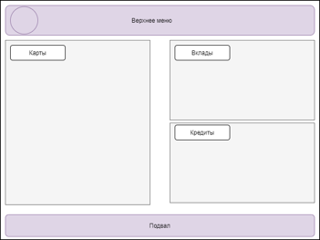

## **Frontend\_Список карт и детали по карте**

**Цель:** документ описывает раздел «Список карт», и дополнительные формы, входящие в раздел.

### **История изменений**

|**Автор**|**Дата изменения**|**Версия изменений**|**Описание**|**Задача**|
| :- | :- | :- | :- | :- |
|Малышева Н.С.|15.09.2021 |1.0|Исходная версия документа|TASK-1|
|Евсеева В.А.|19.04.2022|1.1|
- Доработаны макеты

- Добавлена ссылка на макет в figma

- Изменено описание элемента блока Карты: История операций

- Добавлено описание раздела История операций
||
### **Ссылка на дизайн**

[Макеты figma](https://www.figma.com/file/N5qDmSkGw5VrlDDFiYcf4q/Untitled?node-id=0:1) 

### **Общие требования к разделу**

Раздел доступен всем клиентам ДБО. Раздел открывается сразу после входа в ДБО и является частью «Главного экрана».

**Макет раздела**

` `

### **Блок «Карты»**

Для отображения раздела Frontend инициирует вызов сервиса GET api/cards/list (запрос не параметризован)

В случае если от сервиса получена ошибка или пустой ответ, отображается экран с ошибкой. Текст сообщения «Что-то пошло не так, но мы уже знаем о проблеме…»

В случае если получен успешный ответ, Frontend отображает форму с параметрами:

|**Поле**|**Описание**|
| :- | :- |
|Блок с картами|Содержит экземпляры data/cards[] ответа сервиса GET api/cards/list|
|Элемент Карта| |
|`|`Иконка|
Значение data/cards/cardDesign

Если значение не получено, отображается иконка по-умолчанию
|
|`|`Название карты|
Значение data/cards/name

В поле отображается 100 символов. Если значение больше, то отображается только часть текста и троеточие.

При наведении на такую строку полный текст должен отображаться во всплывающей подсказке.
|
|`|`Платежная система|Значение data/cards/paySystem|
|`|`Номер карты|
Значение data/cards/maskedNumber

Отображается в формате \*XXXX, где XXXX - последние 4 цифры значения
|
|`|`Тип карты|
Значение data/cards/cardtype

В случае если получено значение

- ‘debit’ отобразить текст «Дебетовая»

- ‘credit’ отобразить текст «Кредитная»
|
|`|`Баланс|
Значение data/cards/balance

По-умолчанию отображается зеленым цветом

В случае если значение отрицательное - отображается красным цветом
|
|`|`Статус карты|
Если получено значение data/cards/status:

- ‘active’ - отобразить значение «Активна»

- ‘blocked’- отобразить значение «Заблокирована»

- ‘inactive’ - отобразить значение «Требует активации»
|

Под каждой картой отображаются действия, доступные с картой:

|**Действие**|**Описание**|
| :- | :- |
|Реквизиты|tbd|
|Тарифы|tbd|
|Заблокировать|tbd|
|История операций|
см. Раздел История операций

Элемент представлен ссылкой “Показать историю операций” и кнопкой “Все операции”.

- По нажатию на ссылку появляется раскрывающийся вниз блок   Заголовок блока меняется в зависимости от раскрытия: «Показать/Скрыть историю операций»

- По нажатию кнопки “Все операции” открывается экран “История операций” на месте блока Карты.
|

### **«История операций»**
#### **Отображение краткой истории операций.**
Пользователь нажимает ссылку “Показать историю операций” в блоке Карты, Frontend инициирует вызов сервиса POST api/{card\_id}/operations (описание сервиса в документе **API\_Получение истории операций по карте**).

В списке **краткой истории** отображаются операции за последние 10 дней, но не больше чем 5 операций. Параметры запроса заполняются в соответствии с таблицей:

|**Параметр**|**Значение**|
| :- | :- |
|filter/startDate |Текущая дата минус 10 дней|
|filter/endDate|Текущая дата|
|count|5|
|page|0|
В случае, если от сервиса получена ошибка, отображается экран с ошибкой: «Что-то пошло не так, но мы уже знаем о проблеме…»

В случае, если от сервиса получен пустой ответ, отображается сообщение: “Список операций пуст”.

В случае, если получен успешный непустой ответ, Frontend отображает раскрывающийся блок со списком операций под блоком Карта с параметрами:

|**Поле** |**Описание**|
| :- | :- |
|**Блок с операциями**|Содержит экземпляры operations[] ответа сервиса POST /api/{card\_id}/operations|
|Элемент Операция||
|`|`Иконка операции/мерчанта|Заполняется иконкой из ответа POST /api/{card\_id}/operations в параметре operations/mcc/icon|
|`|`Название операции/название мерчанта|Заполняется значением параметра operations/merchantName ответа POST /api/{card\_id}/operations|
|`|`Сумма и валюта операции|Заполняется значением параметров operations/amount и operations/currency ответа POST /api/{card\_id}/operations (через пробел)|
|`|`Категория операции|Заполняется значением параметра operations/mcc/name ответа POST /api/{card\_id}/operations|
|`|`Время совершения операции|Заполняется значением параметра operations/operDate ответа POST /api/{card\_id}/operations без учета даты.|

Операции сгруппированы по дате operations/operDate ответа /api/{card\_id}/operations (без учета времени).

#### **Отображение полной истории операций.**

Пользователь нажимает кнопке  “Все операции” в блоке Карты, Frontend инициирует вызов сервиса POST api/{card\_id}/operations (описание сервиса в документе **API\_Получение истории операций по карте**).

Frontend инициирует вызов сервиса GET api/operations/mccData (описание сервиса в документе **API\_Получение кодов mcc**).

В списке **полной истории операций** отображаются операций сгруппированы по дате operations/operDate ответа /api/{card\_id}/operations (без учета времени)..

Параметры запроса заполняются в соответствии с таблицей:

|**Параметр**|**Значение**|
| :- | :- |
|filter/startDate |Первые день текущего месяца|
|filter/endDate|Текущая дата|
|count|25|
|page|0|
В случае, если от сервиса получена ошибка, отображается экран с ошибкой: «Что-то пошло не так, но мы уже знаем о проблеме…»

В случае, если от сервиса получен пустой ответ, отображается сообщение: “Список операций пуст”.

В случае, если получен успешный непустой ответ, Frontend отображает блок История операций на месте блока со списком карт. 

Параметры блока История операций:

|**Поле** |**Описание**|
| :- | :- |
|**Плашка заголовка**|-|
|Иконка Закрыть|По нажатию блок закрывается и осуществляется возврат в блок карты.|
|Заголовок |“Все операции”|
|Платежная система|Значение data/cards/paySystem|
|Номер карты|
Значение data/cards/maskedNumber

Отображается в формате \*XXXX, где XXXX - последние 4 цифры значения
|
|**Блок Фильтров**|-|
|Тип операции|
Поле с выпадающим списком. По умолчанию выбрано значение “Все операции”. Возможные значения: “Оплата услуг в ИБ” “POS” “Операции с наличными(ATM)” “Платный запрос баланса карты” “P2P” “Комиссия”

“Операции с наличными (KAS)”

“Перевод по счету”

Пользователь может выбрать несколько значений.

Для подтверждения выбора в конце списка отображается кнопка “Подтвердить”. При нажатии “Подтвердить” заполняется параметр filter/operType запроса /api/{card\_id}/operations 
|
|Категория|
Поле с выпадающим списком. По умолчанию выбрано “Все категории”.

Для отображения значений в выпадающем списке используется значение параметра mccList/name ответа сервиса api/operations/mccData.

Пользователь может выбрать несколько значений.

Для подтверждения выбора в конце списка отображается кнопка “Подтвердить”. При нажатии “Подтвердить” заполняется параметр filter/mccCode запроса /api/{card\_id}/operations значением кода code из ответа api/operations/mccData.
|
|Период с|Поле для ввода даты начала периода запрашиваемой истории. По умолчанию заполнено датой первого дня месяца. При смене пользователем значения - заполняется параметр filter/startDate запроса /api/{card\_id}/operations |
|Период по|
Поле для ввода даты окончания периода запрашиваемой истории.

По умолчанию заполнено текущей датой. При смене пользователем значения - заполняется параметр filter/endDate запроса /api/{card\_id}/operations
|
|Сортировка|
Выпадающий список. Возможные значения: “Сначала новые операции” “Сначала старые операции” “По сумме от большего к меньшему” “По сумме от меньшего к большему”

По умолчанию выбрано “Сначала новые”.

При смене пользователем значения - заполняется параметр sort/ запроса /api/{card\_id}/operations в соответствии с маппингом: “Сначала новые операции”: sort/lastFirst=true “Сначала старые операции”: sort/lastFirst=false “По сумме от большего к меньшему”: sumDesc=true

“По сумме от меньшего к большему”: sumDesc=false
|
|**Блок с операциями**|Содержит экземпляры operations[] ответа сервиса POST /api/{card\_id}/operations|
|Элемент Операция||
|`|`Иконка операции|Заполняется иконкой из ответа POST /api/{card\_id}/operations в параметре operations/mcc/icon|
|`|`Название операции/ мерчанта|Заполняется значением параметра operations/merchantName ответа POST /api/{card\_id}/operations|
|`|`Сумма и валюта операции|Заполняется значением параметров operations/amount и operations/currency ответа POST /api/{card\_id}/operations (через пробел)|
|`|`Категория операции|Заполняется значением параметра operations/mcc/name ответа POST /api/{card\_id}/operations|
|`|`Время совершения операции|Заполняется значением параметра operations/operDate ответа POST /api/{card\_id}/operations без учета даты.|
|Кнопка “Загрузить еще”|По кнопке отправляется запрос POST /api/{card\_id}/operations с инкрементированным значением параметра page.|